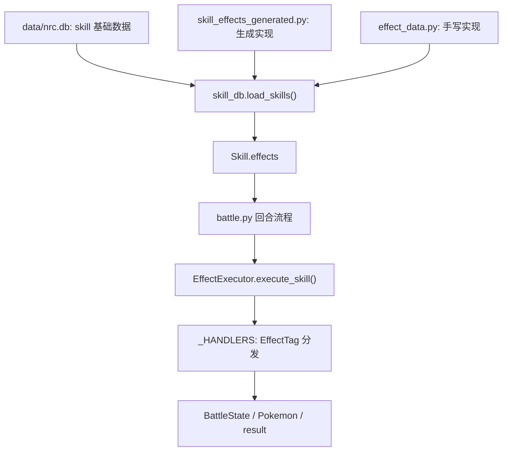

# 技能实现逻辑整理

这份文档整理当前技能系统的实现方式。逐技能的完整实现清单见 `docs/SKILL_IMPLEMENTATIONS.md`，这里重点说明数据流、效果模型、执行阶段，以及后续新增/修正技能时应该改哪里。

## 当前状态

- 数据库技能数：469
- 当前有结构化效果的技能：469
- 手写技能实现：127
- 生成技能实现：342
- 空实现：0
- 效果原语枚举：197 个
- 已注册 handler：196 个
- 未注册普通 handler：`INTERRUPT`

`INTERRUPT` 不是缺失的普通执行器，它在应对逻辑里被特殊处理：`battle.py` 会在技能主效果执行前检查打断，`EffectExecutor.execute_counter()` / `execute_counter_se()` 也会把它解释为应对打断结果。

## 文件职责

| 文件 | 职责 |
| --- | --- |
| `data/nrc.db` | 技能基础数据、精灵数据、学习关系。技能页和队伍配置以这里为数据源。 |
| `src/models.py` | `Skill`、`Pokemon`、`BattleState` 等战斗数据模型。`Skill.effects` 是结构化技能实现入口。 |
| `src/effect_models.py` | 定义效果原语 `E`、技能阶段 `SkillTiming`、`EffectTag`、`SkillEffect`、特性触发 `Timing`。 |
| `src/effect_data.py` | 手写技能/特性效果。这里优先级最高，适合放需要精确实现的技能。 |
| `src/skill_effects_generated.py` | 从技能描述批量生成的兜底实现。不要手改，后续应由生成脚本重建。 |
| `src/skill_db.py` | 从数据库加载技能，并把 generated + manual 合并进 `skill.effects`。 |
| `src/effect_engine.py` | 兼容层，向外 re-export 当前引擎。 |
| `src/engine/_monolith.py` | 当前真实效果执行器。负责 handler 注册、技能阶段执行、应对、特性、迅捷、传动。 |
| `src/battle.py` | 回合流程、能耗扣除、行动顺序、应对调度、最终扣血、击败、换人、回合后处理。 |
| `src/server.py` | 技能页展示用 API，把技能效果转换成前端可读摘要。不是战斗逻辑来源。 |

## 总体数据流



合并规则在 `src/skill_db.py`：

1. 先读取 `SKILL_EFFECTS_GENERATED` 中非空项。
2. 再用 `SKILL_EFFECTS` 覆盖同名技能。
3. 数据库里没有结构化效果的技能会得到空列表。

当前数据库里的 469 个技能都有结构化效果。

## 技能基础数据

技能的基础数值来自 `skill` 表，核心字段是：

- `name`：技能名。
- `element`：系别，加载时映射成 `Type`。
- `category`：物攻、魔攻、防御、状态，加载时映射成 `SkillCategory`。
- `energy_cost`：基础能耗。
- `power`：基础威力。
- `description`：用于展示、关键词标记和生成效果。

`skill_db.load_skills()` 还会额外做两件事：

- 从描述中解析 `先手+N` / `先手-N`，写入 `priority_mod`。
- 如果描述含 `迸发`，写入 `skill.burst = True`。
- 如果描述含 `受奉献影响`，写入 `skill.devotion_affected = True`。

## 技能效果模型

### EffectTag

`EffectTag` 是最小效果原语：

```python
T(E.DAMAGE)
T(E.POISON, stacks=2)
T(E.SELF_BUFF, atk=1.0)
```

结构上等价于：

```python
EffectTag(
    type=E.POISON,
    params={"stacks": 2},
    condition={},
    sub_effects=[],
)
```

### SkillEffect

`SkillEffect` 给一组 `EffectTag` 加上执行阶段和过滤条件：

```python
SE(SkillTiming.ON_USE, [T(E.DAMAGE), T(E.POISON, stacks=1)])
SE(SkillTiming.ON_COUNTER, [T(E.INTERRUPT)], category="status")
```

`SE(..., category="status")` 里的 `category` 是过滤条件，常用于应对技能，表示只应对敌方状态技能。

## 技能阶段

当前新格式技能按 `SkillTiming` 执行：

| 阶段 | 作用 |
| --- | --- |
| `PRE_USE` | 使用前修正，如自身增益、动态威力/能耗相关准备。 |
| `IF` | 运行时条件效果，如先手、敌方换人、血量阈值。 |
| `ON_USE` | 主效果阶段。非 `DAMAGE` 标签先执行，`DAMAGE` 标签最后统一计算。 |
| `ON_HIT` | 有伤害时触发，常用于吸血、击败后转化等。 |
| `ON_COUNTER` | 不在主流程立即执行，而是收集到 `result["counter_effects"]`，交给 `battle.py` 的应对流程。 |
| `POST_USE` | 技能内部后处理，如传动、能耗累加、永久变化标记等。 |

注意：`EffectExecutor._execute_skill_se()` 的 `POST_USE` 是技能效果内部阶段；`battle.py` 里还有一个更外层的 `_post_skill_effects()`，会在最终伤害、击败、换人判断之后处理传动、特性触发、技能使用计数等内容。

## 回合中的技能执行流程

一次技能行动大致分成以下层：

1. `execute_full_turn()` 做回合开始处理。
   - 触发战斗开始特性。
   - 触发回合开始特性。
   - 处理湿润印记等回合开始效果。
   - 读取双方行动。
   - 判断应对关系和行动顺序。

2. `_execute_action()` 处理技能释放前的战斗外壳。
   - 换人、聚能、蓄力。
   - 技能槽锁定。
   - 实际能耗计算。
   - `ENERGY_COST_DYNAMIC` 的能耗预扫描。
   - 能量不足时自动聚能或生命代替能耗。
   - 迸发系统。
   - 奉献系统。
   - 先手相关特性临时修正。

3. `_execute_new_engine()` 调用 `EffectExecutor.execute_skill()`。
   - 前置打断检查。
   - 执行技能阶段，得到 `result["damage"]` 和应对信息。
   - 对方防御减伤。
   - 我方应对效果。
   - 对方应对效果。
   - 特性减伤。
   - 最终扣血。
   - 击败效果。
   - 技能后换人。
   - 战斗级后处理。

4. 回合结束时处理天气、冷却、状态、印记、回合结束特性等。

## 伤害标签的特殊点

`E.DAMAGE` 的 handler 主要负责计算伤害并写入 `ctx.result["damage"]`。通常不会立刻扣除目标 HP，最终扣血在 `battle.py` 的 `_apply_damage_to_enemy()`。

这样做的原因是中间还要经过：

- 防御技能减伤。
- 应对修改伤害或打断。
- 特性减伤/免伤。
- 最终扣血和击败判断。

少数附加伤害可能会在 handler 内即时结算，例如星陨印记的额外伤害。

伤害基础公式在 `DamageCalculator.calculate()`：

```text
伤害 = 攻击/防御 × 0.9 × 威力 × 克制倍率 × 本系加成 × 天气倍率 × 连击数 × 独立威力乘区
```

其中攻击端会先套能力等级：

```text
能力等级 = (1 + 我方攻击提升 + 敌方防御降低) / (1 + 我方攻击降低 + 敌方防御提升)
```

物攻技能使用 `attack / defense`，魔攻技能使用 `sp_attack / sp_defense`。

## 应对机制

应对分两步：

1. 回合排序前，`_skill_has_counter_for()` 判断双方技能是否能应对对方技能类型。
2. 实际释放中，`ON_COUNTER` 被收集，随后由 `EffectExecutor.execute_counter()` 或 `execute_counter_se()` 根据敌方技能分类执行。

应对分类映射：

| filter category | 匹配敌方技能 |
| --- | --- |
| `attack` | 物攻、魔攻 |
| `status` | 状态 |
| `defense` | 防御 |
| 空 | 全匹配 |

`INTERRUPT` 是应对专用原语：

- `_check_pre_interrupt()` 会在主效果执行前判断是否被打断。
- `execute_counter_se()` / `execute_counter()` 会把 `INTERRUPT` 写成 `result["interrupted"] = True`。

## 常见原语分组

| 分组 | 代表原语 |
| --- | --- |
| 伤害/回复 | `DAMAGE`、`HEAL_HP`、`HEAL_ENERGY`、`LIFE_DRAIN` |
| 属性变化 | `SELF_BUFF`、`SELF_DEBUFF`、`ENEMY_DEBUFF` |
| 状态 | `POISON`、`BURN`、`FREEZE`、`LEECH`、`METEOR` |
| 印记 | `POISON_MARK`、`MOISTURE_MARK`、`DRAGON_MARK`、`SLOW_MARK`、`MOMENTUM_MARK` |
| 印记操作 | `DISPEL_ENEMY_MARKS`、`STEAL_MARKS`、`MARKS_TO_METEOR` |
| 动态修正 | `POWER_DYNAMIC`、`ENERGY_COST_DYNAMIC`、`SKILL_MOD`、`PERMANENT_MOD` |
| 行动机制 | `FORCE_SWITCH`、`FORCE_ENEMY_SWITCH`、`AGILITY`、`DRIVE` |
| 天气 | `WEATHER` |
| 特性复用 | 大量 `ABILITY_*`、`ON_*`、`ENTRY_*`、`CUTE_*` 原语也复用同一套 handler |

## 当前技能效果统计

按当前 `Skill.effects` 递归统计，主要阶段分布：

| 阶段 | 数量 |
| --- | ---: |
| `ON_USE` | 448 |
| `ON_COUNTER` | 108 |
| `PRE_USE` | 43 |
| `POST_USE` | 37 |
| `ON_HIT` | 6 |
| `IF` | 5 |

使用最多的原语：

| 原语 | 数量 |
| --- | ---: |
| `DAMAGE` | 294 |
| `DAMAGE_REDUCTION` | 44 |
| `SELF_BUFF` | 37 |
| `PERMANENT_MOD` | 27 |
| `SKILL_MOD` | 27 |
| `POWER_DYNAMIC` | 21 |
| `ENEMY_DEBUFF` | 13 |
| `ABILITY_COMPUTE` | 13 |
| `HEAL_ENERGY` | 11 |
| `FORCE_SWITCH` | 11 |

## 新增或修正技能的推荐流程

1. 先确认 `data/nrc.db` 里有这个技能，并且有对应 `pokemon_skill` 学习关系。
2. 如果只是展示数据错误，改爬虫或数据库导入来源。
3. 如果是战斗效果不准，优先在 `src/effect_data.py` 中添加同名手写配置。
4. 使用 `SE(SkillTiming.X, [...])` 表达阶段，用 `T(E.X, ...)` 表达具体原语。
5. 如果现有 `E` 无法表达该机制：
   - 在 `src/effect_models.py` 新增枚举。
   - 在 `src/engine/_monolith.py` 新增 `_h_xxx` handler。
   - 把新原语注册进 `_HANDLERS`。
   - 如用于特性且需要不同语义，再考虑 `_ABILITY_HANDLER_OVERRIDES`。
6. 运行最小验证：
   - `python3 -m py_compile src/effect_models.py src/effect_data.py src/skill_db.py src/engine/_monolith.py src/battle.py`
   - 加载技能库，确认目标技能有 `effects`。
   - 用一场最小战斗或接口检查前端展示。

## 写配置时的注意事项

- 不要手动编辑 `src/skill_effects_generated.py`，它是生成文件。
- 手写配置只需要覆盖“不准或特殊”的技能，简单攻击类可以留给生成文件。
- `ON_USE` 中会先执行非 `DAMAGE`，再执行 `DAMAGE`，所以威力/连击修正应放在同一阶段或更早阶段。
- 应对效果请使用 `ON_COUNTER`，并用 `category` 过滤敌方技能类型。
- 需要击败后触发的效果，优先使用 `ON_HIT` + `on_kill=True`，或在 `battle.py` 的击败阶段已有逻辑中承接。
- 能耗类效果如果影响“本次实际扣能”，要确认 `_execute_action()` 是否已经预扫描或提前处理；只在 handler 中改 `skill.energy_cost` 通常会影响后续而不是本次。
- 换人、强制换人、应对方脱离都不要在 handler 内直接改 `current_a/current_b`，应写入 result，由 `battle.py` 统一处理。
- UI 展示摘要来自 `server.py` 的 `_skill_effect_display()`，如果新增原语后技能页显示不友好，需要同步补展示映射。

## 后续整理方向

当前 `src/engine/_monolith.py` 仍是单体执行器，`src/engine/__init__.py` 已经预留拆分方向。比较稳的拆分顺序是：

1. 先把过滤逻辑拆到 `filters.py`。
2. 再把基础伤害/回复、状态、印记、行动机制、特性原语拆成多个 `handlers_*.py`。
3. 把 `_HANDLERS` 和 `_apply_tag()` 放到 `registry.py`。
4. 最后把 `EffectExecutor` 放到 `executor.py`。

拆分时保持 `src/effect_engine.py` 的 re-export 不变，就能减少外部调用点改动。
